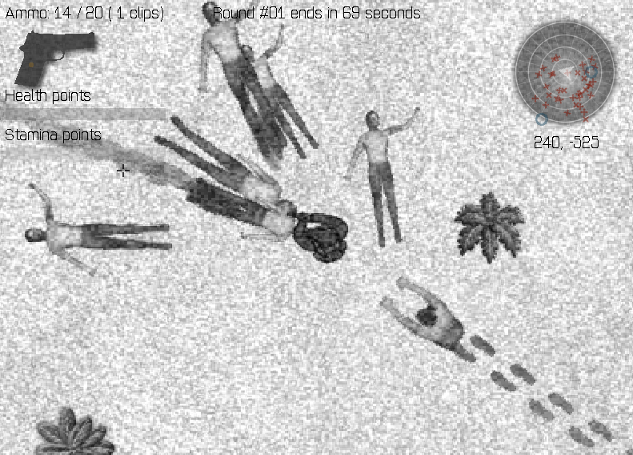
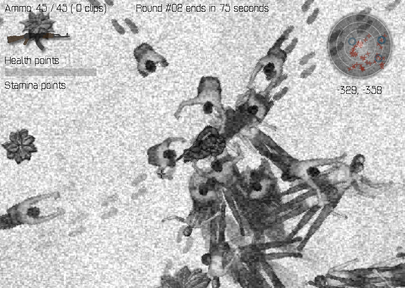

### Crimsonland-like game

#####Commands

-map [Width]x[Height] - to set map size equal to Width times Height pixels
-window [Width]x[Height] - to set window size equal to Width times Height pixels
-num_enemies [num] - to set desired maximal number of enemies
-num_plants [num] - to set desired maximal number of plants
-max_health [num] - to set desired max player health
-max_stamina [num] - to set desired max player stamina
-hp_regen [num] - to set player health regeneration speed
-stamina_regen [num] - to set player stamina regeneration speed
-num_effects [num] - to set desired maximal number of effects
-start_round [num] - to set initial round number

##### Demo:

